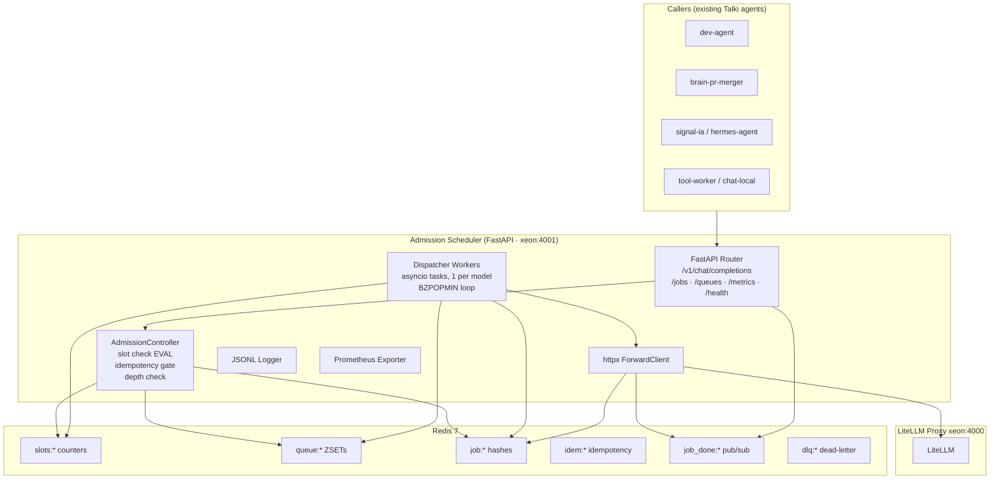

# talki-llm-admission-scheduler

**HTTP-layer admission control, queuing, and JSONL lifecycle logging for self-hosted LLM stacks.**

A lightweight FastAPI side-car that sits in front of a [LiteLLM proxy](https://github.com/BerriAI/litellm) and adds what LiteLLM's native scheduler cannot reliably provide: per-model concurrency slots with atomic enforcement, a bounded priority queue that actually fills during saturation, sync and async dispatch modes, and an append-only JSONL event log that gives operators full visibility into every request's lifecycle. Designed for prosumer and enthusiast GPU stacks (vLLM + llama.cpp on consumer GPUs) where backend saturation otherwise cascades into timeouts for all callers.

> **Status: prototype.** The scheduler has not yet been run in front of production Talki traffic. See [docs/integration-plan.md](docs/integration-plan.md) for the planned rollout approach. Feedback and PRs welcome.

---

## Why this exists

LiteLLM is excellent for routing and fallbacks. It is not a reliable admission controller for local GPU backends. Five specific gaps motivated this side-car:

1. **Priority scheduler is BETA and broken.** [Issue #6867](https://github.com/BerriAI/litellm/issues/6867) (closed as "not planned"): the scheduler's polling loop immediately drains the queue the moment any healthy deployment exists, regardless of priority order. Priority is illusory under any real load.
2. **`max_parallel_requests` drifts under burst.** [Issue #16011](https://github.com/BerriAI/litellm/issues/16011): with 200 concurrent callers and `max_parallel_requests=5`, the backend sees 112–200 simultaneous requests. The atomic guarantee simply does not hold.
3. **No HTTP-layer queue.** When saturated, LiteLLM returns HTTP 429 immediately. There is no mechanism for a caller to wait its turn. Every caller must implement its own backoff and retry — which they don't, causing thundering herd on retry.
4. **No native JSONL lifecycle log.** LiteLLM has rich callback integrations (Langfuse, OTel, Datadog…) but no "write to a local file" path. On a self-hosted stack you want a plain file you can `tail -f` or `jq`-pipe without running an observability platform.
5. **No per-model queue depth or slot-utilization metrics.** `litellm_in_flight_requests` is global. There is no way to tell which model alias is saturated, or how long callers are waiting.

Full gap analysis: [docs/litellm-audit.md](docs/litellm-audit.md).

---

## Architecture



Each incoming request hits the AdmissionController, which atomically checks concurrency slots via a Lua `INCR`/`DECR` script. If a slot is free the job is dispatched immediately. If all slots are occupied and the queue has room, the job is enqueued on a Redis ZSET (score = priority tier × 10¹² + enqueue nanoseconds). A per-model asyncio dispatcher loop (`BZPOPMIN`) pops jobs in priority order and forwards them to LiteLLM. On completion, results are stored in a job hash, a pub/sub channel fires, and the waiting sync caller unblocks.

Full design details: [docs/architecture.md](docs/architecture.md).

---

## Quick start (Docker)

**Prerequisites**: Docker 24+, `docker compose` v2.20+, the repo cloned to the host, and a running LiteLLM proxy accessible at `host.docker.internal:4000`.

```bash
# 1. Clone
git clone https://github.com/fossouo/talki-llm-admission-scheduler.git
cd talki-llm-admission-scheduler

# 2. Create log directory (container runs as UID 10001)
sudo mkdir -p /mnt/talki-logs/admission-scheduler
sudo chown 10001:10001 /mnt/talki-logs/admission-scheduler

# 3. Build and start
docker compose up -d --build

# 4. Verify — both services should be "Up (healthy)" within 60 s
docker compose ps
```

### Smoke test — sync

```bash
curl -X POST http://localhost:4001/v1/chat/completions \
  -H "Content-Type: application/json" \
  -d '{
    "model": "chat-fast",
    "messages": [{"role": "user", "content": "ping"}],
    "max_tokens": 16
  }' | jq .choices[0].message.content
```

Expected: a short text string forwarded from LiteLLM. The `X-Job-Id` response header carries the scheduler's internal job identifier.

### Smoke test — async submit + poll

```bash
# Submit
JOB=$(curl -fsS -X POST http://localhost:4001/jobs \
  -H "Content-Type: application/json" \
  -d '{
    "model": "chat-fast",
    "messages": [{"role": "user", "content": "ping async"}],
    "max_tokens": 16
  }')
echo "$JOB" | jq .
JOB_ID=$(echo "$JOB" | jq -r .job_id)

# Poll until terminal
for i in $(seq 1 30); do
  STATUS=$(curl -fsS "http://localhost:4001/jobs/$JOB_ID" | jq -r .status)
  echo "[$i] $STATUS"
  [[ "$STATUS" == "completed" || "$STATUS" == "failed" || "$STATUS" == "timeout" ]] && break
  sleep 2
done

# Retrieve result
curl -fsS "http://localhost:4001/jobs/$JOB_ID" | jq .
```

For full deployment details including Xeon-specific config, log inspection, Redis debugging, and rollback procedures: [deploy/xeon-runbook.md](deploy/xeon-runbook.md).

---

## Configuration

The scheduler is configured via a single YAML file. The default values ship in [`config/default.yaml`](config/default.yaml). Xeon-specific overrides (container-network Redis URL, host-gateway LiteLLM URL, bind-mounted log path) live in [`config/xeon.yaml`](config/xeon.yaml).

The most-edited keys:

```yaml
scheduler:
  redis_url: "redis://localhost:6379/0"        # Redis connection string
  backend_litellm_url: "http://xeon:4000"       # Upstream LiteLLM proxy
  log_dir: "/mnt/talki-logs/admission-scheduler" # JSONL event log directory

defaults:
  max_concurrency: 3      # Concurrent LiteLLM requests per model (default)
  max_queue_depth: 50     # Max jobs waiting per model before 429
  max_wait_seconds: 120   # Queue TTL per job; exceeded → HTTP 408
  sync_timeout_seconds: 120  # Sync-mode wait limit; exceeded → HTTP 504, job continues
  priority: 5             # Default priority tier (1=critical … 9=batch)

models:
  code:
    max_concurrency: 2
    max_queue_depth: 20
    max_wait_seconds: 180
    sync_timeout_seconds: 300
    priority: 3
  chat-fast:
    max_concurrency: 4
    max_queue_depth: 40
    max_wait_seconds: 60
    sync_timeout_seconds: 120
    priority: 5
  brain-exec:
    max_concurrency: 1
    max_queue_depth: 5
    max_wait_seconds: 300
    sync_timeout_seconds: 600
    priority: 3
  tool-worker:
    max_concurrency: 6
    max_queue_depth: 100
    max_wait_seconds: 30
    sync_timeout_seconds: 60
    priority: 5
```

To override for a deployment, edit the relevant YAML and restart the container (no rebuild needed — config is bind-mounted):

```bash
docker compose restart admission-scheduler
```

Full schema reference: [docs/architecture.md §9](docs/architecture.md#9-config-schema).

---

## Endpoint reference

The scheduler exposes 7 endpoints on port `4001`:

| Method | Path | Request | Response | Notable status codes |
|--------|------|---------|----------|---------------------|
| `POST` | `/v1/chat/completions` | OpenAI `ChatCompletion` body + optional `X-Submit-Async: true` header | OpenAI response (sync) or `{job_id, status, position_in_queue}` (async) | 200 ok · 202 async accepted · 408 queue timeout · 429 queue full (+ `Retry-After`) · 504 sync timeout |
| `POST` | `/jobs` | Same body as above; always async | `{job_id, status, position_in_queue}` | 202 accepted · 429 queue full |
| `GET` | `/jobs/{job_id}` | — | `{job_id, status, model, priority, wait_ms, runtime_ms, result?, error_class?, …}` | 200 · 404 not found · 410 result expired (>1 h after terminal) |
| `POST` | `/jobs/{job_id}/cancel` | — | `{job_id, status}` | 200 (terminal or already cancelled) · 202 cancelling · 404 not found |
| `GET` | `/queues` | — | `{queues: {model: {depth, in_use, capacity, oldest_enqueue_ms}}}` | 200 |
| `GET` | `/metrics` | — | Prometheus text exposition | 200 |
| `GET` | `/health` | — | `{status: ok\|degraded\|down, redis, litellm, workers: {model: {alive}}}` | 200 ok/degraded · 503 down |

**Async mode** on `/v1/chat/completions` can be activated three ways:
- Header `X-Submit-Async: true`
- Query parameter `?async=true`
- Using the `/jobs` endpoint directly

The `X-Job-Id` response header is set on every response so sync callers can fall back to polling if a 504 is returned.

---

## JSONL log format

One file per UTC day: `events-YYYY-MM-DD.jsonl`. Rotated at 00:00 UTC. Written by an asyncio queue consumer — disk I/O is off the hot path.

Representative events:

```jsonl
{"ts":"2026-05-26T09:12:03.441Z","request_id":"0191e...","job_id":"0191f...","model":"chat-fast","event":"queued","caller":"dev-agent","caller_metadata":{},"priority":5,"queue_depth_at_admission":3}
{"ts":"2026-05-26T09:12:04.882Z","request_id":"0191e...","job_id":"0191f...","model":"chat-fast","event":"dispatched","caller":"dev-agent","caller_metadata":{},"priority":5,"wait_ms":1441}
{"ts":"2026-05-26T09:12:07.209Z","request_id":"0191e...","job_id":"0191f...","model":"chat-fast","event":"completed","caller":"dev-agent","caller_metadata":{},"priority":5,"wait_ms":1441,"runtime_ms":2327,"tokens_prompt":48,"tokens_completion":16}
{"ts":"2026-05-26T09:15:11.003Z","request_id":"0192a...","job_id":"0192b...","model":"code","event":"failed","caller":"brain-pr-merger","caller_metadata":{},"priority":3,"error_class":"backend_5xx","error_message":"502 from LiteLLM","http_status":502}
{"ts":"2026-05-26T09:18:55.770Z","request_id":"0193c...","job_id":"0193d...","model":"brain-exec","event":"timeout","caller":"hermes-agent","caller_metadata":{},"priority":3,"stage":"queue","waited_ms":300012}
```

All events share the base fields `ts`, `request_id`, `job_id`, `model`, `event`, `caller`, `caller_metadata`, `priority`. Each event type adds specific fields (e.g. `wait_ms` on `dispatched`, `tokens_prompt`/`tokens_completion` on `completed`, `error_class` on `failed`).

Full field reference: [docs/architecture.md §10](docs/architecture.md#10-jsonl-log-schema).

---

## Metrics

All metrics carry a `model` label unless noted. Scraped at `GET /metrics` (Prometheus text format).

| Metric | Type | Meaning |
|--------|------|---------|
| `admission_requests_total` | Counter | Requests by outcome (`admitted`, `queued`, `rejected`, `idempotent_hit`) |
| `queue_depth` | Gauge | Jobs currently waiting in the priority queue |
| `slots_in_use` | Gauge | Concurrency slots currently occupied |
| `slots_capacity` | Gauge | Configured max concurrency slots |
| `queue_wait_seconds` | Histogram | Time from enqueue to dispatch |
| `request_duration_seconds` | Histogram | End-to-end: admission → terminal state |
| `backend_duration_seconds` | Histogram | LiteLLM round-trip only |
| `failure_total` | Counter | Failed jobs by `error_class` |
| `timeout_total` | Counter | Timeouts by `stage` (queue or sync) |
| `cancel_total` | Counter | Cancelled jobs |
| `worker_crash_total` | Counter | Dispatcher crashes detected by lease watcher |
| `dlq_depth` | Gauge | Dead-letter queue depth |
| `log_write_errors_total` | Counter | JSONL write failures (no `model` label) |
| `redis_errors_total` | Counter | Redis errors by `operation` label |

Histogram buckets: `[0.1, 0.5, 1, 2, 5, 10, 30, 60, 120, 300, 600]` seconds.

Full metric definitions with label descriptions: [docs/architecture.md §11](docs/architecture.md#11-prometheus-metrics).

---

## Comparison with LiteLLM native features

Do you need this side-car? This table summarises the gap analysis from [docs/litellm-audit.md](docs/litellm-audit.md):

| Capability | LiteLLM has it? | Side-car adds it? |
|------------|----------------|-------------------|
| Rate limits (TPM/RPM) | Yes, production-ready | No (keep in LiteLLM) |
| Fallbacks, cooldowns, circuit breaker | Yes, production-ready | No (keep in LiteLLM) |
| Routing strategies (least-busy, latency, cost) | Yes | No (keep in LiteLLM) |
| Priority queue (HTTP layer) | BETA, broken ([#6867](https://github.com/BerriAI/litellm/issues/6867)) | **Yes** |
| Atomic max-concurrency enforcement | Buggy under burst ([#16011](https://github.com/BerriAI/litellm/issues/16011)) | **Yes** |
| Queue on saturation (instead of hard 429) | No | **Yes** |
| Per-entry queue wait TTL | No | **Yes** |
| Async submit + poll mode (HTTP layer) | No | **Yes** |
| JSONL lifecycle log (local file) | No | **Yes** |
| Queue depth / slot utilization metrics | No | **Yes** |

If your LiteLLM deployment is never saturated and you do not need async dispatch, you do not need this side-car. If you are running long-context reasoning models on consumer GPUs and your callers all retry on 429, you do.

---

## Status

**Prototype — not yet in production.**

The code is fully implemented and passes unit tests. It has not been run in front of real LiteLLM traffic. The integration plan (shadow mode → canary → full rollout) is documented in [docs/integration-plan.md](docs/integration-plan.md).

Known open design questions (not blockers for prototype use):

- Streaming responses: the side-car buffers the entire LiteLLM response. SSE/streaming is not supported in v0.1.
- Fallback chain: the YAML schema is frozen but the feature is not implemented. See [docs/architecture.md §8](docs/architecture.md#8-fallback-policy-design-only).
- Config hot-reload: requires a restart. SIGHUP support deferred to a future version.
- Multi-instance: designed via Redis coordination but not tested at scale.

---

## Roadmap (next steps)

- **Streaming responses** — pipe SSE tokens through the dispatcher without buffering the full response.
- **Fallback chain** — implement the designed fallback policy (trigger on `backend_5xx`, `backend_timeout`; chain to alternate model aliases with configurable retry count).
- **Config hot-reload** — SIGHUP handler that reloads YAML and adjusts slot capacity with a drain-then-resize semantic.
- **Multi-instance horizontal scaling** — the Redis coordination layer is already designed for it; needs an integration test harness with N scheduler replicas behind a load balancer.
- **Webhook callbacks** — `POST` to a configurable URL on job terminal events (completed, failed, timeout), for callers that prefer push over pull.

---

## Benchmarks

A benchmark battery ships in [`benchmarks/`](benchmarks/README.md). It runs against the **fake LiteLLM** backend — numbers measure scheduler overhead and queue isolation behavior, not LLM throughput.

```bash
bash scripts/run-local-bench.sh
```

**Headline result — isolation test** (from `benchmarks/results/sample-run.md`):

> `chat-fast` p95 e2e during `code`-model saturation = **85.7 ms**  
> vs. low-load baseline = **639.5 ms** (ratio 0.13×, well under the 2× acceptance criterion)

The `code` model (max_concurrency=2) and `chat-fast` (max_concurrency=4) use completely independent queues and slot counters. Saturating one does not block the other — which is the core scheduler guarantee.

Full scenario descriptions, acceptance criteria, and how to interpret the JSON output: [benchmarks/README.md](benchmarks/README.md).

---

## Contributing

This is an open-source experiment. Issues and pull requests are welcome.

Please ensure:
- New endpoints are covered by a route-level test in `tests/`.
- Any change to the JSONL schema or Prometheus metric names is reflected in `docs/architecture.md §10` / `§11`.
- Docker builds cleanly (`docker compose up -d --build`) before submitting a PR.

License: MIT. See [LICENSE](LICENSE).

---

## References

- [LiteLLM repository](https://github.com/BerriAI/litellm)
- [docs/litellm-audit.md](docs/litellm-audit.md) — full feature audit and gap analysis
- [docs/architecture.md](docs/architecture.md) — full design specification
- [docs/integration-plan.md](docs/integration-plan.md) — staged rollout plan
- [deploy/xeon-runbook.md](deploy/xeon-runbook.md) — operator runbook for Xeon deployment
