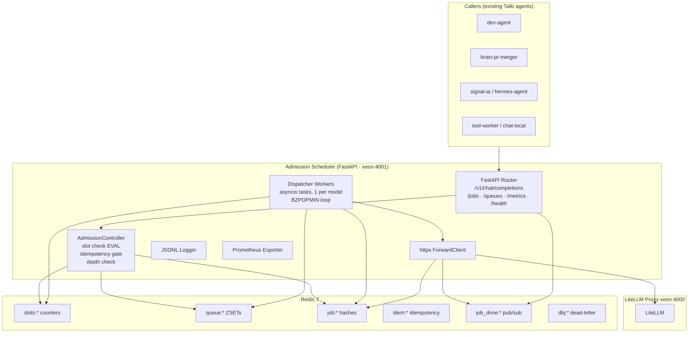

# Local LLM Admission Scheduler — Architecture

**Version**: 0.1.0-draft
**Date**: 2026-05-26
**Context**: Side-car to LiteLLM proxy (`http://xeon:4000`). Motivation: LiteLLM's native priority scheduler is BETA and unreliable under concurrent load, `max_parallel_requests` enforcement drifts under race conditions, and there is no native JSONL lifecycle log. Full audit in [`litellm-audit.md`](./litellm-audit.md).

**See also**: [README.md](../README.md) · [docs/litellm-audit.md](litellm-audit.md) · [docs/integration-plan.md](integration-plan.md) · [deploy/xeon-runbook.md](../deploy/xeon-runbook.md)

---

## 1. Component Diagram



---

## 2. Lifecycle State Machine

```
received → admitted ──► dispatched ──► completed | failed | cancelled
                 │           │
                 └► queued ──┘
                       │
                       ├─► timeout
                       └─► cancelled

received → rejected (queue full, terminal)
```

| Transition | Trigger | Redis ops | Log event | Metric |
|---|---|---|---|---|
| received → admitted | `in_use < capacity` | `EVAL incr_slot` | `admitted` | `admission_total{result=admitted}` |
| received → queued | slot full, queue OK | `ZADD queue:{m}`, `HSET job:{id}` | `queued` | `admission_total{result=queued}` |
| received → rejected | slot full AND queue full | `HSET status=rejected` | `rejected` | `admission_total{result=rejected}` |
| queued → dispatched | BZPOPMIN + EVAL claim | `EVAL claim_slot`, `HSET status=dispatched` | `dispatched` (wait_ms) | `queue_wait_seconds` |
| queued → timeout | TTL watcher | `HSET status=timeout, ZREM` | `timeout` | `timeout_total{stage=queue}` |
| dispatched → completed | httpx 2xx | `HSET response_blob, DECR in_use, PUBLISH` | `completed` (runtime_ms) | `request_duration_seconds` |
| dispatched → failed | httpx error | `HSET error_class, DECR, PUBLISH` | `failed` | `failure_total{error_class}` |
| any → cancelled | cancel API | `ZREM, HSET status=cancelled, DECR if dispatched` | `cancelled` | `cancel_total` |

**Error classes**: `queue_timeout`, `sync_timeout`, `backend_5xx`, `backend_timeout`, `backend_429`, `network_error`, `worker_crash`, `admission_rejected`.

---

## 3. Redis Data Model

### Slot counters
```
slots:{model}:in_use     STRING   atomic INCR/DECR
slots:{model}:capacity   STRING   set at boot, immutable at runtime
```

### Queue (priority-aware)
**Decision: ZSET with score = `priority_tier * 1e12 + enqueue_epoch_ns`.** Lower score = higher urgency. `BZPOPMIN` blocks atomically (Redis 5+).

```
queue:{model}   ZSET   member=job_id, score=composite
```

Priority tiers: `1=critical, 3=high, 5=normal (default), 7=low, 9=batch`.

### Job state hash (TTL 3600s after terminal)
```
job:{job_id}   HASH
  model, status, priority,
  enqueue_ts, dispatch_ts, complete_ts,
  response_blob (gzipped JSON, completed only),
  error_class, caller, idempotency_key
```

### Idempotency
```
idem:{sha256(key)}   STRING   value=job_id   TTL=86400s
```
`SET idem:{hash} {job_id} NX EX 86400` — if exists, return cached job_id.

### Pub/Sub
```
job_done:{job_id}   payload="completed"|"failed"|"timeout"|"cancelled"
```

### Inflight tracking + Dead-letter
```
inflight:{model}   ZSET   score=dispatch_epoch (for lease watcher)
dlq:{model}        SET    members=crashed job_ids
```

---

## 4. Concurrency Primitives

### Atomic slot claim (Lua)
```lua
-- KEYS[1]=slots:{m}:in_use, KEYS[2]=slots:{m}:capacity
-- ARGV[1]=job_id, ARGV[2]=ts_iso
local in_use   = tonumber(redis.call('GET', KEYS[1])) or 0
local capacity = tonumber(redis.call('GET', KEYS[2]))
if in_use < capacity then
  redis.call('INCR', KEYS[1])
  redis.call('HSET', 'job:'..ARGV[1], 'status', 'dispatched', 'dispatch_ts', ARGV[2])
  return 1
end
return 0
```

### Slot release
`DECR slots:{m}:in_use` atomic. Integrity check every 60s reconciles against actual dispatched count.

### Orphan reclaim (worker crash)
```
lease:{job_id}   TTL = max(sync_timeout, 60) + 30s buffer
```
Lease-watcher scans `inflight:{model}` ZSET via `ZRANGEBYSCORE` for expired leases — marks `failed/worker_crash`, releases slot, adds to `dlq:{m}`.

---

## 5. Sync Mode

`POST /v1/chat/completions` → create job → `SUBSCRIBE job_done:{id}` with timeout = `sync_timeout_seconds`.

- **sync_timeout exhausted**: `HTTP 504`. Job continues; caller may poll via `X-Job-Id` response header.
- **max_wait exhausted while queued**: `HTTP 408` with `error_class=queue_timeout`.
- **max_queue_depth full at admission**: `HTTP 429` with `Retry-After: {estimated_drain_s}`.

---

## 6. Async Mode

`POST /jobs` → 202 `{job_id, status, position_in_queue}`.
`GET /jobs/{job_id}` → status + result/error + wait_ms/runtime_ms.

`position_in_queue` = `ZRANK queue:{m} {job_id}` (O(log N)).

**Result retention**: 3600s after terminal, then `HTTP 410 Gone`.

---

## 7. Cancellation

| Current status | Action | Response |
|---|---|---|
| queued | ZREM, HSET cancelled, PUBLISH | 202 `cancelled` |
| dispatched | mark cancelling, raise CancelledError on httpx task, DECR, PUBLISH | 202 `cancelling` |
| terminal | no-op | 200 current status |
| unknown | — | 404 |

---

## 8. Fallback Policy (Design Only)

```yaml
models:
  code:
    fallback_policy:
      enabled: false
      trigger_on: [backend_5xx, backend_timeout]
      chain:
        - model: chat-fast
          max_attempts: 1
```

Out of scope for v0.1; YAML shape frozen so callers can pre-configure.

---

## 9. Config Schema

```yaml
scheduler:
  redis_url: "redis://localhost:6379/0"
  backend_litellm_url: "http://xeon:4000"
  worker_poll_timeout_seconds: 5
  lease_watcher_interval_seconds: 10
  integrity_check_interval_seconds: 60
  log_dir: "/mnt/talki-logs/admission-scheduler"
  log_rotate_utc_midnight: true

defaults:
  max_concurrency: 3
  max_queue_depth: 50
  max_wait_seconds: 120
  sync_timeout_seconds: 120
  priority: 5
  fallback_policy: {enabled: false}

models:
  code:        {max_concurrency: 2, max_queue_depth: 20, max_wait_seconds: 180, sync_timeout_seconds: 300, priority: 3}
  chat-fast:   {max_concurrency: 4, max_queue_depth: 40, max_wait_seconds: 60,  sync_timeout_seconds: 120, priority: 5}
  brain-exec:  {max_concurrency: 1, max_queue_depth: 5,  max_wait_seconds: 300, sync_timeout_seconds: 600, priority: 3}
  tool-worker: {max_concurrency: 6, max_queue_depth: 100,max_wait_seconds: 30,  sync_timeout_seconds: 60,  priority: 5}
```

---

## 10. JSONL Log Schema

One file per UTC day: `events-YYYY-MM-DD.jsonl`. Rotated at 00:00 UTC.

**Base fields**: `ts` (RFC3339 ns), `request_id` (UUIDv7), `job_id` (UUIDv7), `model`, `event`, `caller`, `caller_metadata`, `priority`.

**Per-event extras**:
- `queued`: `queue_depth_at_admission`
- `dispatched`: `wait_ms`
- `completed`: `wait_ms, runtime_ms, tokens_prompt, tokens_completion`
- `failed`: `error_class, error_message, http_status`
- `timeout`: `stage, waited_ms`
- `cancelled`: `was_dispatched`
- `rejected`: `queue_depth, capacity`
- `worker_crash`: `lease_age_ms`

---

## 11. Prometheus Metrics

All labels include `model`.

| Metric | Type | Labels | Unit |
|---|---|---|---|
| `admission_requests_total` | Counter | model, result | requests |
| `queue_depth` | Gauge | model | jobs |
| `slots_in_use` | Gauge | model | slots |
| `slots_capacity` | Gauge | model | slots |
| `queue_wait_seconds` | Histogram | model | seconds |
| `request_duration_seconds` | Histogram | model | seconds |
| `backend_duration_seconds` | Histogram | model | seconds |
| `failure_total` | Counter | model, error_class | requests |
| `timeout_total` | Counter | model, stage | requests |
| `cancel_total` | Counter | model | requests |
| `worker_crash_total` | Counter | model | events |
| `dlq_depth` | Gauge | model | jobs |
| `log_write_errors_total` | Counter | — | events |
| `redis_errors_total` | Counter | operation | errors |

Histogram buckets: `[0.1, 0.5, 1, 2, 5, 10, 30, 60, 120, 300, 600]`.

---

## 12. Failure-Mode Catalogue

| Failure | Detection | Behavior | Log/Metric |
|---|---|---|---|
| Redis unreachable | ConnectionError | New requests → 503; in-flight continue | `redis_errors_total++` |
| LiteLLM unreachable | httpx ConnectError | Job failed/network_error, slot released, sync → 502 | `failure_total{network_error}++` |
| LiteLLM 5xx | status ≥ 500 | Job failed/backend_5xx, slot released | `failure_total{backend_5xx}++` |
| LiteLLM 429 | status 429 | Job failed/backend_429, slot released immediately | `failure_total{backend_429}++` |
| Worker crash mid-dispatch | lease TTL expired, status=dispatched | DECR, mark failed/worker_crash, add to dlq | `worker_crash_total++` |
| Disk full on log | IOError | Write dropped, counter++, retry handle | `log_write_errors_total++` |
| Client disconnects mid-sync | starlette signal | Sync handler returns; job continues; poll via X-Job-Id | — |
| Slot drift | integrity check finds in_use > actual dispatched | Hard reset to truth | `redis_errors_total{drift_correction}++` |

---

## 13. Open Design Questions

1. **Per-model worker vs shared pool**: chose per-model (N asyncio tasks, simpler). Revisit if N>20.
2. **Pub/Sub vs asyncio.Event for sync wait**: chose Redis pub/sub for survivability across process restart (~1ms cost).
3. **Response blob in Redis vs disk**: in Redis HASH for v0.1 (small responses, 1h TTL). Move to disk if blobs exceed 50 KB regularly.
4. **Priority score collision (same ns)**: append `INCR seq:{model}` as low-order component instead of pure `enqueue_ns`.
5. **Config hot-reload**: not in v0.1; restart only. Adding SIGHUP later requires careful slot drain semantics.
